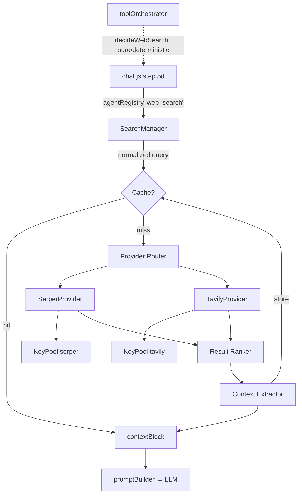

# AQUA Web Search Architecture

Production-grade live-web retrieval, integrated into the Adaptive Tool
Orchestrator. Sprint 1 of the intelligence roadmap — designed so Sprint 2
(Planner), Sprint 3 (Model Router), and Sprint 4 (Memory v2) plug in without
refactoring (see [Extension seams](#extension-seams)).

Companion to `AQUA_MIND_ARCHITECTURE.md`. Code lives in `aqua/src/search/`.

---

## 1. Where it sits in the request flow

Search is a **capability**, not a bolt-on: the orchestrator decides, chat.js
executes, the prompt builder injects. Nothing else in the pipeline changed
shape.

```
POST /api/aqua/chat(/stream)
        │
        ▼
┌─ prepareTurn() ────────────────────────────────────────────────────────────┐
│ 1  classify (classifier.js — unchanged)                                    │
│ 1b identity router (self-questions NEVER search)                           │
│ 2a memoryObserve (mandatory, unchanged)                                    │
│ 2b orchestrate() ──▶ web_search capability enabled/skipped                 │
│      └ decideWebSearch()  pure · deterministic · zero-I/O                  │
│ 2c executionPlan · intelligence (unchanged)                                │
│ 3  memoryRetrieve (unchanged)                                              │
│ 5b projectRetrieve (unchanged)                                             │
│ 5c attachments (unchanged)                                                 │
│ 5d ★ WEB SEARCH — only if capability enabled                               │
│      └ agentRegistry.get('web_search').run() → SearchManager               │
│ 6  buildSystemPrompt(…, searchContext)   ← new additive param             │
│ 7  context window (unchanged)                                              │
└────────────────────────────────────────────────────────────────────────────┘
        │
        ▼
generateText(Stream) → verify → identity guard → persist   (all unchanged)
```

## 2. Subsystem architecture

```
                         ┌──────────────────────┐
     chat.js ──────────▶ │    SearchManager     │  performSearch() — the ONE
   (via agentRegistry)   │  searchManager.js    │  entry point. NEVER throws.
                         └──────────┬───────────┘
              cache hit ◀───────────┤
        ┌──────────────┐            ▼
        │ Search Cache │   ┌──────────────────────┐
        │searchCache.js│   │   Provider Router    │  priority · circuit breaker
        │ TTL·norm-key │   │   searchRouter.js    │  · retry-with-next-key
        └──────▲───────┘   └──────────┬───────────┘
               │            ┌─────────┴─────────┐
               │            ▼                   ▼
               │   ┌───────────────┐   ┌───────────────┐
               │   │SerperProvider │   │TavilyProvider │  SearchProvider
               │   │ X-API-KEY     │   │ Bearer tvly-  │  interface
               │   │ /search /news │   │ native scores │  (providers/)
               │   │ /images       │   │ + answer      │
               │   │ /scholar      │   └───────┬───────┘
               │   └───────┬───────┘           │
               │           ▼                   ▼
               │   ┌───────────────┐   ┌───────────────┐
               │   │KeyPool serper │   │KeyPool tavily │  keyPool.js — rotate ·
               │   │ _1.._N + bare │   │ _1.._N + bare │  cooldown · usage ·
               │   └───────────────┘   └───────────────┘  failure classification
               │                                          (searchErrors.js)
               │        results
               │           ▼
               │   ┌──────────────────────┐
               │   │ Search Result Ranker │  canonical-URL dedupe ·
               │   │   resultRanker.js    │  deterministic scoring
               │   └──────────┬───────────┘
               │              ▼
               │   ┌──────────────────────┐
               │   │  Context Extractor   │  compress · dedupe sentences ·
               │   │ contextExtractor.js  │  fit SEARCH_CONTEXT_TOKENS ·
               │   └──────────┬───────────┘  [n]-numbered citations
               └──────────────┤ store
                              ▼
                   ┌──────────────────────┐
                   │   Context Builder    │  buildSystemPrompt(searchContext)
                   │   promptBuilder.js   │  after project ctx, before task
                   └──────────┬───────────┘  modules · module tag "web_search"
                              ▼
                             LLM
```

Mermaid version (renders on GitHub):



## 3. Module reference

| Module | Responsibility |
|---|---|
| `searchConfig.js` | All `SEARCH_*` env vars, safe defaults, clamping. Zero new env required. |
| `keyPool.js` | Per-provider key lifecycle: load (`_1.._20` + bare), skip empties, dedupe values, round-robin, usage/failure counters, classification-aware cooldowns (auth/quota 15 m · rate-limit 60 s ×2ⁿ capped · transient 20 s), degraded last-resort, `stats()` (never key material). |
| `searchErrors.js` | Failure taxonomy à la `providerErrors.js`: auth/rate/quota → key blame; 5xx/timeout/network → provider strike; **400 → stop burning keys**. |
| `providers/searchProvider.js` | Abstract interface: `search() health() supportsImages() supportsNews() supportsAcademic()`; shared timeout-fetch with injectable `fetchImpl`. |
| `providers/serperProvider.js` | serper.dev adapter — `X-API-KEY`, `/search /news /images /scholar`, normalizes `organic[]` + `answerBox`/`knowledgeGraph`. |
| `providers/tavilyProvider.js` | tavily.com adapter — `Authorization: Bearer`, native relevance scores, `include_answer`, `topic:news`. |
| `searchRouter.js` | Priority chain → per-provider key-retry loop (≤ `SEARCH_RETRY_LIMIT` distinct keys) → circuit breaker (3 consecutive whole-provider failures → open 60 s). Returns `{ok:false}`, never throws. |
| `searchCache.js` | TTL cache; key = type + lowercase, punctuation-stripped, **term-sorted** query ("node 22 release" ≡ "release node 22"); size-capped eviction; `cacheInvalidate(query?)`; hit/miss stats. |
| `resultRanker.js` | Cross-provider dedupe by canonical URL (www/utm/fragment stripped); deterministic score = provider-native×100 ∥ position-decay + term-match(≤30) + freshness(≤15) + docs-domain authority(+10). |
| `contextExtractor.js` | Snippet clipping, cross-source sentence dedupe, provider answer first, header with retrieval date + cite-[n] instruction, **budget-fit** via `estimateTokens` dropping lowest ranks. Raw payloads never reach the LLM. |
| `searchDecision.js` | `decideWebSearch()` — pure weighted scorer. Hard blocks (memory/personal/conversation/creative, "don't search"), force opt-in ("google …"), positive signals (freshness · news · releases · docs · GitHub · pricing · live facts · comparison), negatives (own-repo/attachment/definitional), workspace-grounding penalty that **yields to freshness**, research-profile bias. Also `buildSearchQuery()` (lead-in strip, ≤380 chars). |
| `searchManager.js` | Facade: decide-executed → cache → route → rank → extract → cache-store. Streams real sub-stages. `getSearchHealth()`, `invalidateSearchCache()`. **Fail-open guarantee.** |
| `searchAgent.js` | Registers `'web_search'` in `agentRegistry` on import (verificationAgent pattern) — closes the seam `capabilities.js` documented. |

## 4. Smart search decision — examples

| Message | Decision | Why |
|---|---|---|
| "What is the latest Node.js LTS?" | ✅ | freshness + release |
| "Official docs for Express 5 middleware" | ✅ | docs |
| "GitHub repo for tanstack query" | ✅ | github |
| "Current pricing of Vercel Pro" | ✅ | pricing (+definitional waived by *current*) |
| "Compare Bun vs Node 2026 benchmarks" | ✅ | comparison + year + research |
| "Is the Stripe API down right now?" | ✅ | status + temporal |
| "Write a poem about the ocean" | ❌ | creative → hard block |
| "What is 245 × 17?" | ❌ | pure math |
| "What's my favorite language?" | ❌ | memory → hard block |
| "Explain this function in my repo" (workspace) | ❌ | workspace-grounded |
| "Explain the concept of recursion" | ❌ | definitional/timeless — profile bias alone never forces |
| "Is the express version **in this repo** still supported **upstream**?" (workspace) | ✅ | freshness overrides grounding |

## 5. Error-handling ladder (spec-exact, proven in tests)

```
Serper key#1 fails ─▶ classify ─▶ cool key ─▶ Serper key#2 … (≤ RETRY_LIMIT)
      all Serper keys fail ─▶ circuit strike ─▶ Tavily key#1 …
            all Tavily keys fail ─▶ { used:false } ─▶ chat continues WITHOUT search
```

`performSearch()` cannot throw. A dead search subsystem is byte-identical to
a disabled one from the chat pipeline's perspective.

## 6. Streaming events

Existing `stage` protocol carries the new sub-stages — the **pre-built SPA
renders them with zero dist changes** (ThinkingIndicator shows any
`{id,label}`; unknown event types are ignored by design in `chatStream.ts`):

| SSE | id / payload | Label |
|---|---|---|
| `stage` | `classify` (existing) | 🧠 Understanding request → "Understanding your request…" |
| `stage` | `search` | 🔍 Searching the web… |
| `stage` | `search_provider` | 🌐 Using Serper… / Using Tavily… |
| `stage` | `search_rank` | 📑 Ranking sources… |
| `stage` | `search_context` | 📝 Building context… |
| `search` *(new event)* | `{used, cached, provider, query, sources[]}` | structured grounding for future source-chips UI |
| `stage` | `generate` (existing) | ✍ Generating response… |
| `done` | `search:{…}` block added | ✓ Done |

`POST /chat` (non-stream) carries the same `search` block in its JSON
payload. Cached hits stream `search → search_context` only — stages are real
work, never animation.

## 7. Configuration

| Env | Default | Notes |
|---|---|---|
| `SERPER_API_KEY[_1.._20]` / `TAVILY_API_KEY[_1.._20]` | — | any subset; blanks skipped; duplicate values deduped |
| `SEARCH_TIMEOUT` | `8000` ms | per HTTP attempt (clamped 500–60000) |
| `SEARCH_MAX_RESULTS` | `6` | post-ranking cap (1–20) |
| `SEARCH_PROVIDER_PRIORITY` | `serper,tavily` | unknown names warned + dropped |
| `SEARCH_CACHE_TTL` | `900000` (15 m) | |
| `SEARCH_ENABLE_CACHE` | `true` | `false/0/no/off` disables |
| `SEARCH_RETRY_LIMIT` | `3` | distinct keys per provider per query (1–10) |
| `SEARCH_CONTEXT_TOKENS` | `1200` | injected-block budget |
| `SEARCH_CACHE_MAX_ENTRIES` | `200` | oldest-first eviction |

## 8. Observability

* `[SEARCH]` structured `AQUA_SEARCH` log line per executed search
  (`logSearchEvent` — query truncated, attempts chain, tokens; never the
  full block, never key material).
* Metrics: `searchEvents{performed,cached,failed,noResults}`,
  `searchByProvider` — in `GET /api/aqua/provider-health → metrics`.
* `GET /api/aqua/provider-health → search`: per-slot key usage/cooldowns,
  circuit state, cache hit/miss, effective config.
* Startup: key summary or dormant-search warning (warn-only, never blocks
  boot — Issue-6 contract).

## 9. Integration diff summary (everything outside `src/search/`)

| File | Change | Nature |
|---|---|---|
| `orchestrator/toolOrchestrator.js` | `ctx.userMessage` | +1 field, purity intact (test 12 ✓) |
| `orchestrator/capabilities.js` | `web_search` override → real detection | replaces the documented placeholder |
| `core/promptBuilder.js` | `searchContext` param (default `''`) | additive; legacy calls byte-identical |
| `routes/chat.js` | `prepareTurn` → async (internal-only fn); step 5d; `search` SSE + payload block | both call sites awaited; identity-guarded |
| `core/observability.js` | `logSearchEvent` + counters | additive |
| `core/startupValidation.js` | search-key summary | warn-only |
| `routes/health.js` | `search:` section | additive |
| `package.json` ×2 | `test:search` | additive |

**Not changed:** provider LLM router, classifier contract, memory engine,
Mind, project intelligence, edit engine, any public API shape, any frontend
file. `POST /chat` responses for non-search turns are byte-identical.

## 10. Extension seams (Sprint 2–4 ready)

* **Planner (S2):** `performSearch({type})` already routes `news / images /
  academic`; a planner issues typed multi-queries through the same facade —
  fan-out/merge lives above SearchManager, nothing below changes.
* **Model Router (S3):** search is provider-agnostic context; the `search`
  payload block gives the router grounding-quality signal per turn.
* **Memory v2 (S4):** `sources[]` + `normalizedQuery` are stable ids for
  citation memory; `invalidateSearchCache()` is the freshness hook.
* **New search provider:** subclass `SearchProvider` + one `KeyPool` + one
  entry in `searchRouter.PROVIDERS`. Router/manager/decision untouched.

## 11. Tests

`npm run test:search` (in `aqua/`) — 52 tests / 11 suites: key rotation,
cooldown escalation, degraded mode, no-secret-leak, error taxonomy, cache
TTL/eviction/invalidation/phrasing-equivalence, ranker dedupe + determinism,
extractor budget-fit + sentence dedupe, full decision matrix (spec YES/NO,
opt-in/out, freshness-vs-workspace), router fallback ladder, circuit
breaker, 400-stops-key-burn, adapter wire formats (headers/endpoints/body),
timeout mapping, manager end-to-end with stages, cache-serves-zero-calls,
**fail-open ×3**, orchestrator flip + purity, prompt injection order +
backward compat.

Full engine regression after integration: **29/29 previously-passing suites
still pass** (135+ tests). The 2 failing suites
(`projectRetriever.digest`, `symbolGraph.events-jobs`) fail identically on
the pristine pre-change archive — they cover the not-yet-applied
`digest_wiring.diff` / call-graph increments in the repo root, unrelated to
search and untouched per mission scope.
